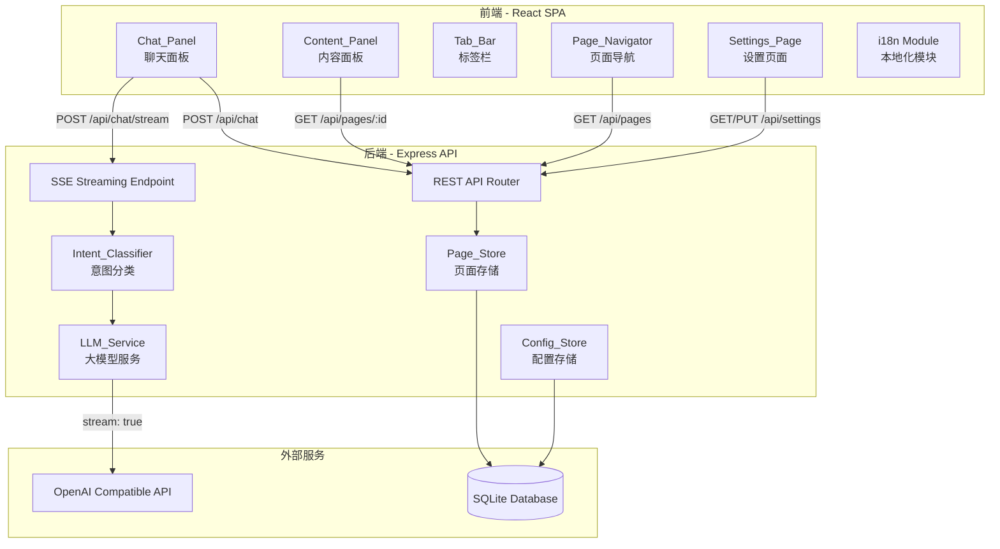

# Design Document: AI Knowledge Explorer (迭代 2)

## Overview

本次迭代在现有 AI Knowledge Explorer 基础上解决 6 个核心问题：UI 多语言本地化、运行时设置页面、Tab 关闭功能、基于 title 的页面去重、Marked_Term 标题一致性、以及流式内容生成。

技术栈保持不变：前端 React + TypeScript + Vite，后端 Node.js + Express + SQLite，LLM 调用使用 OpenAI 兼容 API。新增 SSE (Server-Sent Events) 用于流式内容传输，新增 i18n 模块用于 UI 本地化。

## Architecture



### 前端布局（更新）

```
+------------------------------------------+
|  [🏠 主页] [⚙ 设置] [🌐 语言]            |
|  [Tab1 ✕] [Tab2 ✕] [Tab3 ✕]             |
+------------------+-----------------------+
|                  |                       |
|   Content_Panel  |    Chat_Panel         |
|   (左侧 ~65%)   |    (右侧 ~35%)        |
|                  |                       |
|   - 流式渲染内容  |    - 消息列表          |
|   - 标记词高亮    |    - 输入框            |
|                  |    - 发送按钮          |
+------------------+-----------------------+
```

## Components and Interfaces

### 前端组件（新增/修改）

#### 1. i18n 模块 (`client/src/i18n.ts`)
- 定义翻译字典类型 `Translations`，包含所有 UI 文本的 key
- 提供 `zh-CN`、`en`、`ja` 三套翻译
- 导出 `t(key, lang)` 函数，根据当前语言返回对应文本
- 语言偏好存储在 `localStorage` 的 `explorer-lang` key 中
- App 初始化时从 localStorage 读取语言设置

#### 2. Tab_Bar 组件 (`client/src/components/TabBar.tsx`)
- 维护打开的 tab 列表，每个 tab 包含 `{ id, title }` 
- 每个 tab 显示页面标题和关闭按钮 (✕)
- 点击 tab 切换当前显示页面
- 点击关闭按钮移除该 tab
- 关闭当前活动 tab 时，切换到相邻 tab；无 tab 时回到 Home_Page
- Tab 状态由 App.tsx 管理，通过 props 传入

#### 3. Settings_Page 组件 (`client/src/components/SettingsPage.tsx`)
- 通过顶部导航的设置按钮进入
- 提供 LLM 提供商选择（OpenAI / Azure OpenAI）
- 根据选择的提供商动态显示对应配置字段：
  - OpenAI: API Key, Base URL (可选), Model
  - Azure: API Key, Endpoint, Deployment, API Version
- 保存按钮调用 `PUT /api/settings` 持久化配置
- 页面加载时调用 `GET /api/settings` 获取当前配置
- API Key 字段使用 password 类型输入框

#### 4. Chat_Panel（修改）
- 所有硬编码中文文本替换为 `t(key, lang)` 调用
- 语言选择器移到顶部导航栏

#### 5. Content_Panel（修改）
- 支持流式渲染：接收 SSE 事件，逐步更新 innerHTML
- 流式进行中显示闪烁光标指示器
- 流式完成后正常渲染完整页面

#### 6. HomePage（修改）
- 所有硬编码中文文本替换为 `t(key, lang)` 调用

#### 7. PageNavigator（修改）
- 所有硬编码中文文本替换为 `t(key, lang)` 调用

### 后端 API（新增/修改）

#### 新增 Endpoints

```
GET /api/settings
  Response: { provider: string, config: ProviderConfig }

PUT /api/settings
  Body: { provider: "openai" | "azure", config: ProviderConfig }
  Response: { success: boolean }

POST /api/chat/stream
  Body: { message: string, currentPageId?: string, lang?: string }
  Response: SSE stream
    event: intent
    data: { action: "new_page" | "append" | "modify", pageId?: string }

    event: chunk
    data: { content: string }

    event: done
    data: { page: KnowledgePage, chatMessage: string, action: string }

    event: error
    data: { error: string }
```

#### 修改 Endpoints

```
POST /api/pages/by-term（修改）
  - 查找逻辑改为：先精确匹配 title（case-insensitive），再模糊匹配（LIKE %term%）
  - 生成新页面时，prompt 中明确要求 title 必须为传入的 term 原文
  Body: { term: string, lang?: string }
  Response: { page: KnowledgePage, isNew: boolean }
```

### 后端服务（新增/修改）

#### Config_Store (`server/src/configStore.ts`)
- 使用 SQLite 新增 `app_config` 表存储运行时配置
- 提供 `getSettings()` 和 `saveSettings(settings)` 方法
- 配置项：provider, api_key, base_url, model, endpoint, deployment, api_version
- API Key 在数据库中加密存储（使用 AES-256-GCM，密钥从环境变量 `CONFIG_ENCRYPTION_KEY` 读取，若无则使用默认密钥）

#### LLM_Service（修改）
- 新增 `generatePageStream(question, lang)` 方法，返回 `AsyncIterable<string>`
- 使用 OpenAI SDK 的 `stream: true` 参数
- 新增 `generatePageByTerm(term, lang)` 方法，prompt 中强制要求 title 等于 term
- 支持运行时切换 LLM 客户端（当 Config_Store 中的配置变更时重新创建客户端）

#### LLM Client Factory（修改）
- 新增 `createLLMClientFromConfig(config)` 方法，从运行时配置创建客户端
- 保留原有环境变量方式作为 fallback
- 优先使用运行时配置，无配置时回退到环境变量

## Data Models

### 新增/修改类型

```typescript
// 运行时 LLM 配置
interface LLMSettings {
  provider: 'openai' | 'azure';
  apiKey: string;
  // OpenAI specific
  baseUrl?: string;
  model?: string;
  // Azure specific
  endpoint?: string;
  deployment?: string;
  apiVersion?: string;
}

// Tab 状态
interface TabItem {
  id: string;      // page ID
  title: string;   // page title
}

// i18n 翻译字典
interface Translations {
  [key: string]: string;
}

// SSE 事件类型
type SSEEvent =
  | { event: 'intent'; data: { action: string; pageId?: string } }
  | { event: 'chunk'; data: { content: string } }
  | { event: 'done'; data: { page: KnowledgePage; chatMessage: string; action: string } }
  | { event: 'error'; data: { error: string } };
```

### 新增 SQLite Schema

```sql
CREATE TABLE IF NOT EXISTS app_config (
  key TEXT PRIMARY KEY,
  value TEXT NOT NULL
);
```

### Tab 管理逻辑（纯前端状态）

```typescript
// Tab 管理核心函数
function addTab(tabs: TabItem[], page: { id: string; title: string }): TabItem[]
function closeTab(tabs: TabItem[], tabId: string, activeTabId: string): { tabs: TabItem[]; nextActiveId: string | null }
```

- `addTab`: 如果 tab 已存在（按 id 匹配），不重复添加；否则追加到末尾
- `closeTab`: 移除指定 tab。如果关闭的是当前活动 tab，选择右侧相邻 tab，若无则选左侧，若都无则返回 null（回到 Home）

## Correctness Properties

*A property is a characteristic or behavior that should hold true across all valid executions of a system—essentially, a formal statement about what the system should do. Properties serve as the bridge between human-readable specifications and machine-verifiable correctness guarantees.*

### Property 1: API response structure validity

*For any* user question string (non-empty, ≤2000 chars), the chat API response SHALL contain a KnowledgePage object with all required fields (id, title, content, summary, createdAt, updatedAt) being non-empty strings, and the action field being one of "new_page", "append", or "modify".

**Validates: Requirements 1.1**

### Property 2: Marked_Term format validity

*For any* HTML content string containing `<span class="marked-term" ...>` elements, each such element SHALL have a non-empty `data-term` attribute whose value matches the element's text content.

**Validates: Requirements 1.3**

### Property 3: Page persistence round-trip

*For any* valid KnowledgePage data (title, content, summary as non-empty strings), storing it in the Page_Store and then retrieving it by ID SHALL produce an object with matching title, content, summary, and non-empty id, createdAt, updatedAt fields.

**Validates: Requirements 3.1, 3.4**

### Property 4: Page list completeness

*For any* set of KnowledgePage objects stored in the Page_Store, the list endpoint SHALL return a PageSummary for each stored page, and the count of summaries SHALL equal the count of stored pages.

**Validates: Requirements 3.2**

### Property 5: Term deduplication and title matching

*For any* term string, if a KnowledgePage with a title matching that term (case-insensitive) already exists in the Page_Store, requesting that term via the by-term endpoint SHALL return the existing page with `isNew: false` and the same page ID. When a new page is generated for a term, the page title SHALL equal the term text.

**Validates: Requirements 2.2, 2.3, 2.4, 2.5**

### Property 6: Append preserves original content

*For any* existing KnowledgePage and any append operation, the resulting page content SHALL contain the original content as a substring, and the content length SHALL be greater than the original.

**Validates: Requirements 4.2**

### Property 7: Cross-page linking on unrelated questions

*For any* chat message classified as unrelated to the current page, the system SHALL create a new page with a different ID and add the new page's ID to the original page's linkedPageIds.

**Validates: Requirements 4.3, 4.4**

### Property 8: Modification persistence

*For any* KnowledgePage that undergoes a modify operation, retrieving the page from the Page_Store after modification SHALL return the updated content, not the original content.

**Validates: Requirements 5.4**

### Property 9: Translation completeness

*For any* supported language code (zh-CN, en, ja) and *for any* UI text key defined in the translation dictionary, the `t(key, lang)` function SHALL return a non-empty string.

**Validates: Requirements 6.1**

### Property 10: Language preference persistence round-trip

*For any* supported language code, saving it to localStorage and then reading it back SHALL return the same language code.

**Validates: Requirements 6.3, 6.4**

### Property 11: Settings persistence round-trip

*For any* valid LLMSettings object, saving it via the settings API and then retrieving it SHALL return an equivalent object (with the same provider, model, endpoint, etc.; API key may be masked in GET response).

**Validates: Requirements 7.5**

### Property 12: Tab management correctness

*For any* list of open tabs and any tab to close, closing a tab SHALL reduce the tab count by exactly one and the closed tab SHALL no longer appear in the list. If the closed tab was the active tab, the next active tab SHALL be the right neighbor (if exists), otherwise the left neighbor, otherwise null.

**Validates: Requirements 8.3, 8.4**

## Error Handling

### LLM Service Errors
- 当 LLM API 调用失败（网络错误、超时、API 限流）时，返回 HTTP 500 或 SSE error 事件
- 当 LLM 返回格式不正确的内容时，尝试提取可用部分，若完全不可用则返回错误
- 设置 LLM 调用超时为 30 秒
- 当无 LLM 配置可用时（无运行时配置且无环境变量），返回 HTTP 503 并提示用户配置设置

### SSE Streaming Errors
- 流式传输中断时，发送 SSE error 事件
- 客户端检测到 error 事件后显示错误提示，保留已接收的部分内容
- SSE 连接超时设置为 60 秒

### Page Store Errors
- 当数据库操作失败时，返回 HTTP 500 并记录错误日志
- 当请求的页面 ID 不存在时，返回 HTTP 404

### Settings Errors
- 无效的配置参数返回 HTTP 400
- 配置加密/解密失败时记录错误并返回 HTTP 500

### 前端错误处理
- API 调用失败时在 Chat_Panel 显示友好的错误提示（使用 i18n）
- SSE 连接断开时显示重连提示
- 页面加载失败时显示重试按钮

## Testing Strategy

### 技术栈

- **前端**: React 18 + TypeScript + Vite
- **后端**: Node.js + Express + TypeScript
- **数据库**: SQLite (better-sqlite3)
- **测试框架**: Vitest
- **Property-Based Testing**: fast-check (与 Vitest 集成)
- **LLM API**: OpenAI 兼容 API (通过 openai npm 包)

### 单元测试

单元测试用于验证具体示例和边界情况：
- Page_Store CRUD 操作的正确性
- Config_Store 读写操作
- i18n `t()` 函数对各语言的返回值
- Tab 管理函数（addTab, closeTab）的边界情况
- Marked_Term 解析和提取逻辑
- 输入验证逻辑
- LLM prompt 中 term 标题强制逻辑
- SSE 事件格式验证

### Property-Based Testing

使用 fast-check 库实现属性测试，每个属性测试运行至少 100 次迭代。

每个测试必须用注释标注对应的设计属性：
- 格式: `// Feature: ai-knowledge-explorer, Property N: [property text]`

属性测试覆盖：
- Property 1: API 响应结构验证
- Property 2: Marked_Term 格式验证
- Property 3: 页面持久化 round-trip
- Property 4: 页面列表完整性
- Property 5: 术语去重与标题匹配
- Property 6: 追加操作保留原始内容
- Property 7: 跨页面链接
- Property 8: 修改持久化
- Property 9: 翻译完整性
- Property 10: 语言偏好持久化 round-trip
- Property 11: 设置持久化 round-trip
- Property 12: Tab 管理正确性

### 测试策略说明

- 单元测试和属性测试互为补充，两者都是必需的
- 单元测试关注具体示例和边界情况
- 属性测试关注跨所有输入的通用属性
- LLM 调用在测试中通过依赖注入替换为可控的 mock，以测试系统逻辑而非 LLM 行为
- 每个 correctness property 对应一个独立的 property-based test
- Tab 管理和 i18n 模块为纯函数，可直接进行属性测试无需 mock
