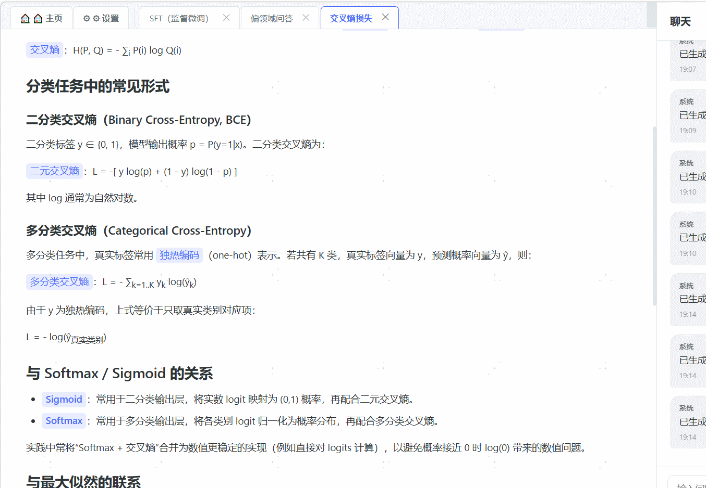

# AI Knowledge Explorer

一个基于 LLM 的交互式知识探索工具。输入任何主题，AI 会为你生成结构化的知识页面，并支持通过对话进一步深入探索。

An interactive knowledge exploration tool powered by LLM. Enter any topic and AI generates structured knowledge pages with conversational deep-dive support.



## ✨ Features

- 🔍 AI-powered knowledge page generation with streaming output
- 💬 Contextual chat for deeper exploration
- 🌐 Multi-language UI (中文 / English / 日本語)
- ⚙️ Web-based settings page for LLM configuration
- 📑 Tab-based page management
- 🐳 Docker support
- Supports OpenAI and Azure OpenAI

## Tech Stack

- Frontend: React 18 + TypeScript + Vite
- Backend: Express + TypeScript
- Database: SQLite (better-sqlite3)
- LLM: OpenAI / Azure OpenAI SDK

## Quick Start

```bash
# Install dependencies
npm install

# Start backend (port 3001)
cd server && PORT=3001 npm run dev

# Start frontend (port 3000, proxies /api to 3001)
cd client && npm run dev
```

Then open http://localhost:3000 and configure your LLM API key in the ⚙ Settings page.

## Production Build

```bash
npm install
cd client && npm run build && cd ..
cd server && npm run build && cd ..

# Start (configure LLM via web settings page after launch)
PORT=3000 node server/dist/index.js
```

The server serves both the API and frontend static files from `client/dist/`.

## Docker

```bash
docker build -t ai-knowledge-explorer .

docker run -d \
  --name ai-knowledge-explorer \
  -p 3000:3000 \
  -v $(pwd)/data:/app/data \
  ai-knowledge-explorer
```

Then configure your LLM provider in the web settings page.

## Environment Variables

All LLM configuration can be done via the web settings page after launch. Environment variables are optional:

| Variable | Default | Description |
|----------|---------|-------------|
| `PORT` | `3000` | Server port |
| `LLM_PROVIDER` | `openai` | `openai` or `azure` |
| `OPENAI_API_KEY` | - | OpenAI API key |
| `OPENAI_BASE_URL` | `https://api.openai.com/v1` | Custom API endpoint (OpenAI-compatible) |
| `OPENAI_MODEL` | `gpt-4o` | Model name |
| `AZURE_OPENAI_API_KEY` | - | Azure OpenAI API key |
| `AZURE_OPENAI_ENDPOINT` | - | Azure OpenAI endpoint URL |
| `AZURE_OPENAI_DEPLOYMENT` | - | Azure OpenAI deployment name |
| `AZURE_OPENAI_API_VERSION` | `2024-08-01-preview` | Azure API version |
| `CONFIG_ENCRYPTION_KEY` | built-in default | Encryption key for stored API keys (set in production) |

## Documentation

See [DEPLOY.md](./DEPLOY.md) for detailed deployment instructions including PM2, Docker, and Nginx reverse proxy setup.

## License

[MIT](./LICENSE)
